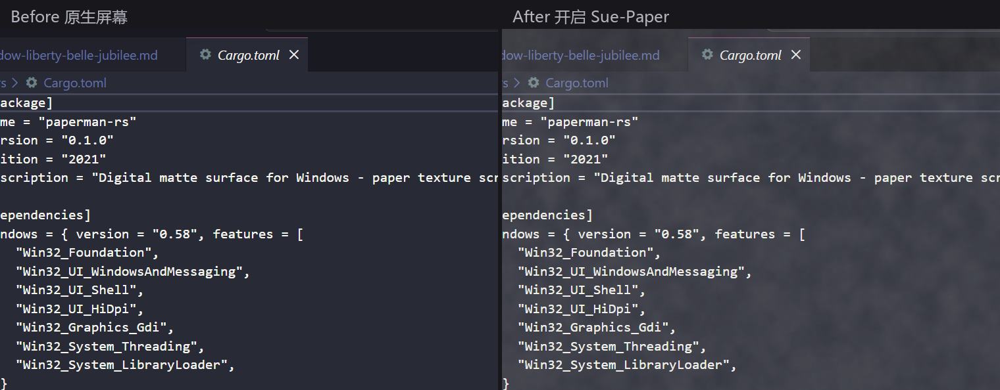
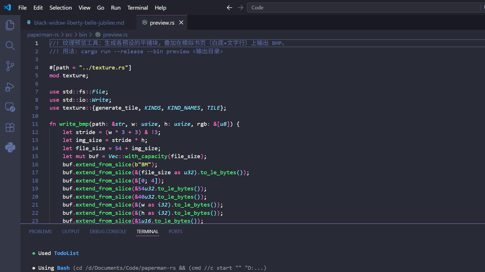

# Sue-Paper

[中文](README.md) | **English**

**Make your screen feel like paper.**

Sue-Paper lays a procedurally generated paper texture over your entire screen, softening harsh highlights and contrast — turning your emissive display into a "digital matte paper". Native Windows, built with Rust + raw Win32, single-file and portable.



## How It Works

Lightweight, and designed to stay out of your way.

- **An invisible sheet of paper.** The overlay runs above all your windows, across every monitor. Your cursor and keystrokes pass straight through — it never takes focus, never shows up in Alt-Tab. You won't notice it's there; you'll just see paper.
- **Pick your paper.** 4 procedurally generated textures (fractal noise, seamlessly tiled, grain stays crisp at any resolution), with 4 intensity levels: 15% / 20% / 25% / 30%.
- **It steps aside on its own.** Add image viewers, editors or video players to the exclusion list and the texture hides itself whenever they come to the front. Or snooze it for 5 / 15 minutes whenever you want a clean screen.

## Four Textures


| Texture | Feel |
|---|---|
| Classic Matte | A clean, soft matte finish — for focused reading |
| Whisper Weave | A delicate fabric grain that softens bright apps |
| Sunbaked Parchment | A warm amber, heavy grain — for late-night writing |
| Vellum Mist | A translucent haze — for long reading sessions |

## Showcase

Reading: the paper texture turns a stark white page into a warm matte surface —

<p align="center">
  
  
  
</p>

It works just as well in dark scenarios (e.g. code editors), visibly softening highlights and contrast:



## Download & Usage

Grab the zip from [Releases](https://github.com/SueBwj/sue-paper/releases), extract and run `sue-paper.exe`. That's it.

Everything lives in the system tray right-click menu: on/off, texture, intensity, snooze, exclude the current foreground app, quit. Settings are persisted to `%APPDATA%/Sue-Paper/settings.json`.

Footprint: ~22–27 MB of memory and 0% CPU at runtime (static texture, updated only when you change it). Multi-monitor support included — overlays rebuild automatically on display changes.

## Build

Requires a Rust stable toolchain (`stable-x86_64-pc-windows-gnu` or MSVC both work):

```sh
./build-release.ps1
# Output: target/release/sue-paper.exe
```

The script builds the program, then embeds the multi-size `S` logo into the EXE's Windows icon resources, so the tray, File Explorer, shortcuts and Start Menu all show the app icon.

Quality checks:

```sh
cargo fmt -- --check
cargo clippy --all-targets -- -D warnings
cargo test --all-targets
```

Note: the `windows` crate is pinned to 0.58 (which uses `windows-targets` prebuilt import libraries).
0.60+ switched to `windows-link`, which invokes dlltool at build time to generate import libraries and needs extra PATH setup on the GNU toolchain — hence not adopted.

## Project Layout

| File | Responsibility |
|---|---|
| `src/main.rs` | Entry point, hidden control window, message loop, timer scheduling, menu command dispatch |
| `src/overlay.rs` | Layered overlay windows (one per monitor) + `UpdateLayeredWindow` presentation |
| `src/texture.rs` | Fractal noise texture generation + 4 presets |
| `src/tray.rs` | Tray icon + context menu |
| `src/exclusion.rs` | Foreground process detection (app exclusion) |
| `src/monitor.rs` | Monitor enumeration |
| `src/settings.rs` | JSON settings persistence |
| `assets/logo-s.png` | Original logo artwork (the letter S) |
| `assets/logo-s-64.bgra` | Tray icon pixel data embedded at compile time |
| `assets/sue-paper.ico` | Multi-size Windows icon for File Explorer and Start Menu |
| `src/bin/embed_icon.rs` | Resource tool that writes the ICO into the release EXE |

## Credits

- Inspired by [Paperman](https://paperman.cc) — the pioneer of the digital matte surface.
- This project is a product of **Vibe Coding**: every line of code, from idea to release, was written through human–AI pair programming — iterating fast, by feel, refining while using it.

## Not Yet Implemented (Future Iterations)

- Circadian rhythm / scheduled auto-toggle
- Launch at login, per-monitor enablement
