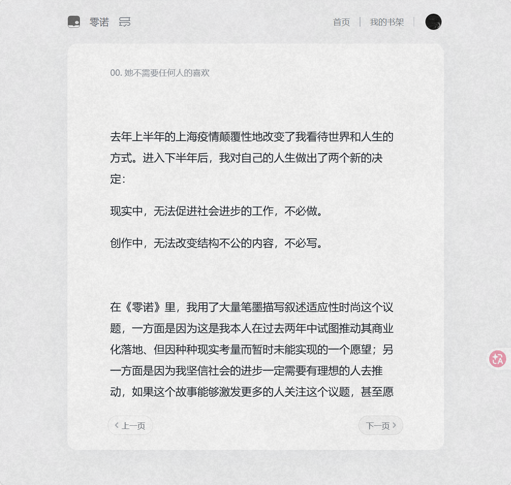
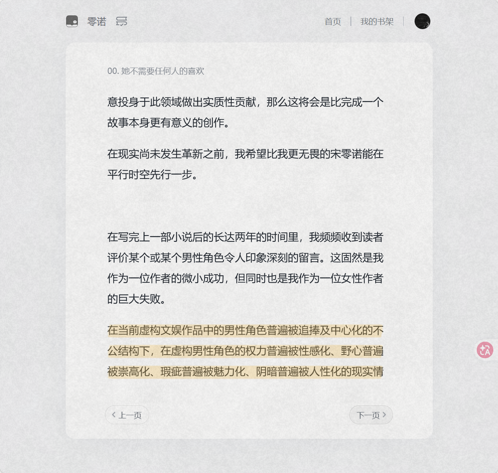
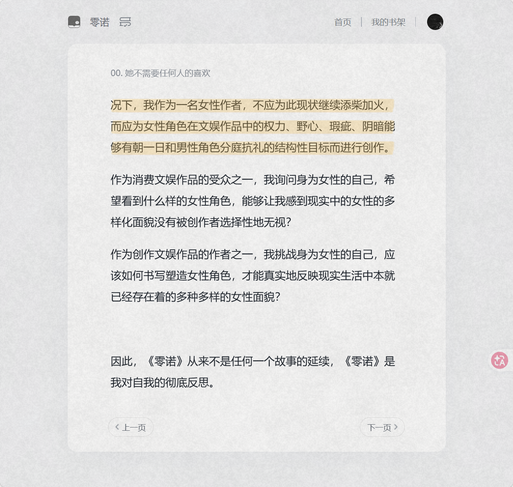
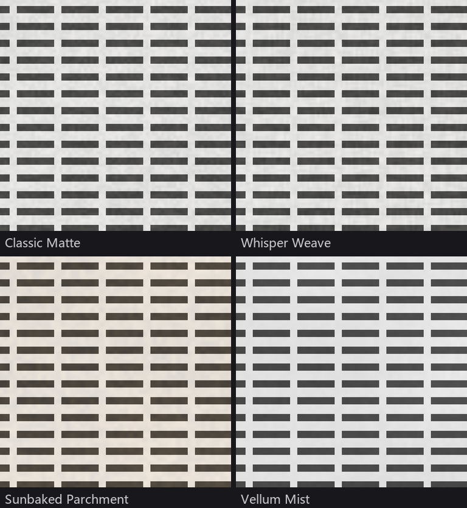

# Sue-Paper

**中文** | [English](README.en.md)

**让你的屏幕摸起来像纸。**

Sue-Paper 在整个屏幕上叠加一层程序生成的纸张纹理，柔化刺眼的高亮与对比度，把发光的屏幕变成一张"数字哑光纸"。Windows 原生，Rust + Win32 直调，单文件免安装。

<p align="center">
  
  
  
</p>

## 工作原理

轻量，且绝不碍事。

- **一层看不见的纸。** 覆盖层运行在所有窗口之上、每一块屏幕。鼠标和键盘直接穿透，不抢焦点，不进 Alt-Tab——你感觉不到它，只看到纸。
- **挑一种纸。** 4 种程序生成纹理（分形噪声、无缝平铺，任意分辨率下颗粒都清晰），强度 15% / 20% / 25% / 30% 四档可调。
- **它会自己让开。** 把看图、剪片、修图的应用加进排除列表，它们来到前台时纹理自动隐藏；也可以"打盹" 5 / 15 分钟，随时要回一块干净的屏幕。

## 四种纹理



| 纹理 | 气质 |
|---|---|
| Classic Matte | 干净柔和的哑光面，适合专注阅读 |
| Whisper Weave | 细腻织物纹理，柔化亮色应用 |
| Sunbaked Parchment | 暖琥珀色厚颗粒，适合夜晚写作 |
| Vellum Mist | 半透明薄雾，适合长时间阅读 |

## 下载与使用

从 [Releases](https://github.com/SueBwj/sue-paper/releases) 下载 zip，解压后运行 `sue-paper.exe` 即可。

一切操作都在系统托盘右键菜单里：开关、纹理、强度、打盹、排除当前前台应用、退出。设置自动保存在 `%APPDATA%/Sue-Paper/settings.json`。

资源占用：内存约 22–27 MB，运行时 0% CPU（静态纹理，仅切换时更新一次）。支持多显示器，显示变化时自动重建覆盖层。

## 构建

需要 Rust stable 工具链（`stable-x86_64-pc-windows-gnu` 或 msvc 均可）：

```sh
./build-release.ps1
# 产物：target/release/sue-paper.exe
```

脚本会先构建程序，再把多尺寸 `S` Logo 写入 EXE 的 Windows 图标资源，使托盘、文件管理器、快捷方式和开始菜单均显示应用图标。

质量检查：

```sh
cargo fmt -- --check
cargo clippy --all-targets -- -D warnings
cargo test --all-targets
```

注意：`windows` crate 固定为 0.58（使用 `windows-targets` 预编译导入库）。
0.60+ 改用 `windows-link` 在构建期调用 dlltool 生成导入库，GNU 工具链下需额外配置 PATH，故未采用。

## 结构

| 文件 | 职责 |
|---|---|
| `src/main.rs` | 入口、隐藏 control 窗口、消息循环、定时器调度、菜单命令分发 |
| `src/overlay.rs` | 分层覆盖窗口（每屏一个）+ `UpdateLayeredWindow` 上屏 |
| `src/texture.rs` | 分形噪声纹理生成 + 4 种预设 |
| `src/tray.rs` | 托盘图标 + 右键菜单 |
| `src/exclusion.rs` | 前台进程名检测（应用排除） |
| `src/monitor.rs` | 显示器枚举 |
| `src/settings.rs` | JSON 设置持久化 |
| `assets/logo-s.png` | Logo 原图（仅含大写字母 S） |
| `assets/logo-s-64.bgra` | 编译期内嵌的托盘图标像素资源 |
| `assets/sue-paper.ico` | 文件管理器与开始菜单使用的多尺寸 Windows 图标 |
| `src/bin/embed_icon.rs` | 将 ICO 写入 release EXE 的资源工具 |

## 致谢与说明

- 灵感来自 [Paperman](https://paperman.cc) —— 数字哑光表面的开创者。
- 本项目是 **Vibe Coding** 的产物：从想法到上线的全部代码由人类与 AI 编程助手协作完成，凭感觉快速迭代，边用边改。

## 未实现（可作为后续迭代）

- 昼夜节律 / 定时自动开关
- 开机自启动、按显示器选择启用
